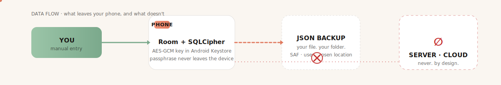

<p align="center">
  
</p>

<h1 align="center">Where Is My Money?<br/><sub>Къде са ми парите?</sub></h1>

<p align="center">
  <em>A finance app that <b>cannot leak your data — it never has any.</b></em>
</p>

<p align="center">
  <a href="#"></a>
  <a href="#"></a>
  <a href="#"></a>
  <a href="#"></a>
  <a href="#"></a>
  <a href="#"></a>
  <a href="#"></a>
  <a href="LICENSE"></a>
  <a href="#"></a>
</p>

---

## ▸ The pitch

Most finance apps survive by **looking at your money**. Bank logins. Behavior tracking. Up-sells.

**Parite** is the opposite design. There is no login because there is no account. There is no cloud because there is no server. The only person who sees your transactions is *you* — and the only place they live is the phone in your pocket, encrypted at rest with a key that never leaves the device.

You type a number. You pick a category. You're done in under two seconds.

That's the whole product.

---

## ▸ Why it's different

|  | Most finance apps | Parite |
|---|---|---|
| Account / login | Required | None |
| Bank aggregation | Plaid / Tink / Salt Edge | None — by design |
| Transaction storage | Their servers | **Your phone**, AES-GCM-wrapped via Android Keystore |
| Backup | Cloud, opt-out at best | Plain JSON to a folder *you* choose (SAF) |
| Tracking SDKs | Plenty | Crashlytics only |
| Pricing | Subscription / ads / freemium | **Free forever.** No tip jar. No "pro." |
| Languages | English, sometimes | **English + Bulgarian**, parity is a hard rule |

---

## ▸ Privacy by structure

Marketing privacy says "we don't sell your data." Structural privacy says **"we couldn't if we wanted to."**

<p align="center">
  
</p>

The crypto picture, in one paragraph: SQLCipher protects the database with a 32-byte passphrase generated once at first launch. That passphrase is wrapped with AES-GCM using a key that lives only inside the Android Keystore — it cannot be extracted, only used. The wrapped ciphertext + IV sits in plain SharedPreferences; without the Keystore key, it's noise. Survives app-data clears. Lost only on factory reset, which is exactly the threat model we want.

Full details in [docs/SECURITY.md](docs/SECURITY.md).

---

## ▸ The stack

```
Kotlin              ─▶  one language, no Java
Jetpack Compose     ─▶  declarative UI, Material 3
Room                ─▶  observable Flow<…> DAOs
SQLCipher           ─▶  database file is encrypted on disk
Android Keystore    ─▶  AES-GCM wraps the SQLCipher passphrase
DataStore           ─▶  preferences (no SharedPreferences sprawl)
BiometricPrompt     ─▶  optional fingerprint / face gate
SAF                 ─▶  backup/restore to user-chosen file
Manual DI           ─▶  ~80 lines of AppContainer, no Hilt
```

No paid dependencies. No `kotlinx.serialization` (we use `org.json`). No chart library — donut and bars are drawn with Compose `Canvas`.

Architecture details: [docs/ARCHITECTURE.md](docs/ARCHITECTURE.md).

---

## ▸ Money math, taken seriously

Floats are a famously bad way to count money. Parite stores every amount as `Long` minor units paired with a currency code:

```kotlin
@JvmInline value class Money(val amountMinor: Long) {
    fun format(currency: String, locale: Locale): String =
        NumberFormat.getCurrencyInstance(locale).apply {
            this.currency = Currency.getInstance(currency)
        }.format(amountMinor / 100.0)
}
```

Account balances are computed in SQL via `JOIN`, never summed on the client beyond display. There is no place in the codebase where two `Double`s get added together and become 0.30000000000000004.

---

## ▸ Bilingual is a structural rule, not a feature

Every shipped string exists in **`values/strings.xml`** and **`values-bg/strings.xml`**. PRs that add an English-only string don't merge.

Seeded entities (categories, accounts) carry a `nameKey` (e.g. `"cat_food"`) so they can be re-translated when the user switches locale, instead of being frozen at install time.

The product has two names, both first-class:

- **Where Is My Money?**  ·  English market, app launcher long form
- **Къде са ми парите?**  ·  Bulgarian market, app launcher long form
- **Парите** ("the money")  ·  short form for both

Contributing strings: [docs/STRINGS.md](docs/STRINGS.md).

---

## ▸ Features (v0.2, deployed)

```
HOME        balance card · today / month spent · recent list · empty state
ADD         calculator keypad · expense / income · accounts · 12-emoji categories · favorites · note · date picker
HISTORY     search-by-note · day grouping · swipe-to-delete with undo · tap-to-edit
ANALYTICS   donut by category · daily bar · top categories · month selector
SETTINGS    biometric toggle · JSON backup (SAF) · JSON restore (REPLACE-mode) · language
```

Queued for v1.x: Quick-Settings tile, home-screen widget, recurring auto-logs, streaks, on-home insights. Tracked in [docs/ROADMAP.md](docs/ROADMAP.md).

---

## ▸ Building it

```bash
# from Git Bash on Windows
./gradlew.bat installDebug
adb -s emulator-5554 shell am force-stop bg.parite.app.debug
adb -s emulator-5554 shell am start -n bg.parite.app.debug/bg.parite.app.MainActivity
```

Detailed setup, AVD notes, signing: [docs/BUILD.md](docs/BUILD.md).

---

## ▸ Documentation map

| Document | Read it when… |
|---|---|
| [`docs/ARCHITECTURE.md`](docs/ARCHITECTURE.md) | "Where does X live? How do flows fit together?" |
| [`docs/SECURITY.md`](docs/SECURITY.md) | You're reviewing the crypto, the backup format, or the threat model. |
| [`docs/BUILD.md`](docs/BUILD.md) | First time building, debugging the wrapper, deploying to a fresh emulator. |
| [`docs/STRINGS.md`](docs/STRINGS.md) | Adding a new screen / button / dialog string. |
| [`docs/ROADMAP.md`](docs/ROADMAP.md) | What's done, what's queued, what's intentionally deferred. |

---

## ▸ Project tenets

These aren't aspirations — they're constraints. PRs that violate any of them don't merge.

1. **Free forever.** No subscription. No ads. No tip jar. No "pro tier."
2. **No backend.** No accounts. No bank aggregation. No cloud sync of transactions.
3. **EN + BG parity, always.** A string ships in both, or it doesn't ship.
4. **Money is `Long` minor units.** Never `Double`. Never `Float`.
5. **`@RequiresApi` on framework-called overrides is forbidden.** Gate inside with `Build.VERSION.SDK_INT`.
6. **Restore is REPLACE-only.** Partial-merge is a separate design problem.
7. **No paid dependencies.** Including OCR, charts, serialization, fonts.

---

## ▸ License

MIT. Use it, fork it, ship a better one. The point is the *idea* of structural privacy in personal finance — if a thousand variants exist, that's a win.

---

<p align="center">
  <sub>Built with calm code and zero analytics.<br/>
  <code>bg.parite.app</code> · made for Android · made in Bulgaria</sub>
</p>
