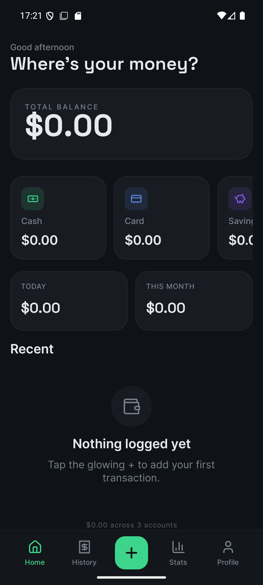
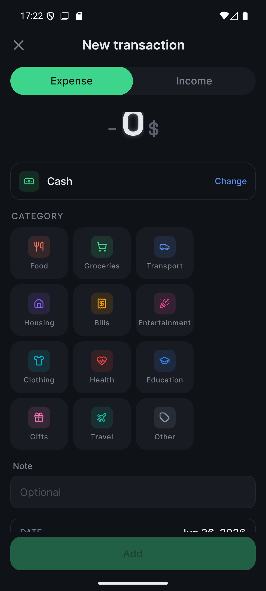
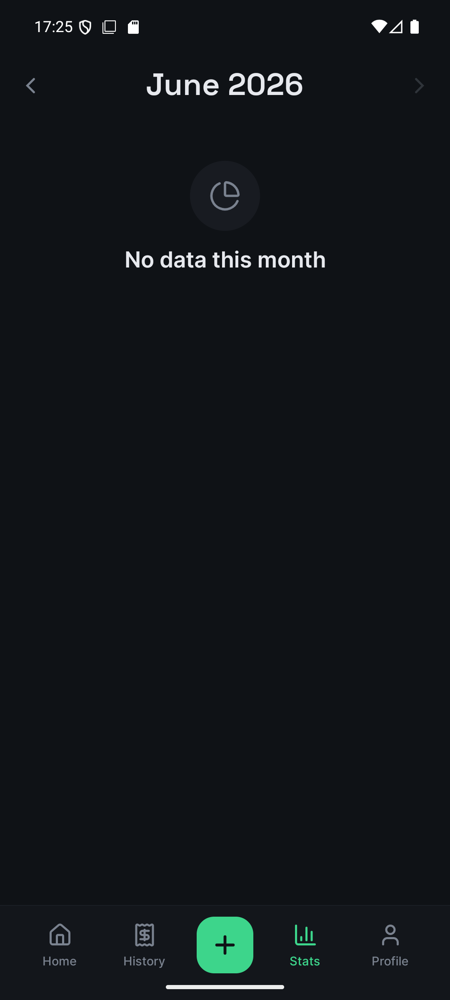
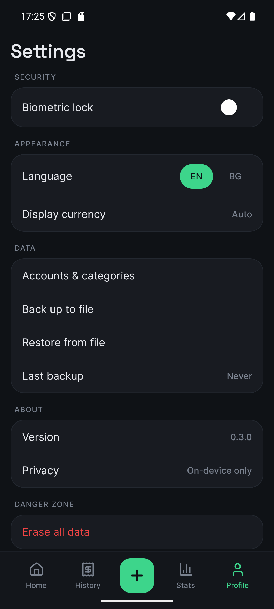

<p align="center">
  
</p>

<h1 align="center">Where Is My Money?<br/><sub>Къде са ми парите?</sub></h1>

<p align="center">
  <em>A finance app that <b>cannot leak your data — it never has any.</b></em>
</p>

<p align="center">
  <a href="#"></a>
  <a href="#"></a>
  <a href="#"></a>
  <a href="#"></a>
  <a href="#"></a>
  <a href="LICENSE"></a>
  <a href="#"></a>
</p>

---

## ▸ The pitch

Most finance apps survive by **looking at your money**. Bank logins. Behavior tracking. Up-sells.

**Parite** is the opposite design. There is no login because there is no account. There is no cloud because there is no server. The only person who sees your transactions is *you* — and the only place they live is the phone in your pocket, encrypted at rest with a key that never leaves the device.

You type a number. You pick a category. You're done in under two seconds.

That's the whole product.

---

## ▸ Why it's different

|  | Most finance apps | Parite |
|---|---|---|
| Account / login | Required | None |
| Bank aggregation | Plaid / Tink / Salt Edge | None — by design |
| Transaction storage | Their servers | **Your phone**, SQLCipher-encrypted with a hardware-backed key |
| Backup | Cloud, opt-out at best | Plain JSON you export to a place *you* choose |
| Tracking SDKs | Plenty | **Zero** — no network code at all (enforced by a test) |
| Pricing | Subscription / ads / freemium | **Free forever.** No tip jar. No "pro." |
| Languages | English, sometimes | **English + Bulgarian**, parity is a hard rule |

---

## ▸ Privacy by structure

Marketing privacy says "we don't sell your data." Structural privacy says **"we couldn't if we wanted to."**

Financial data lives in an on-device **SQLCipher** database. Its 32-byte key is generated once and stored only in the hardware keychain/keystore via `expo-secure-store` — it can be used, never extracted. The app contains **no network code whatsoever** (a unit test fails the build if `fetch`/`XHR`/`WebSocket`/`axios` ever appears). Fonts and translations are bundled; nothing is fetched. Backups are plain JSON that you explicitly export and share.

<p align="center">
  
</p>

Full details in [docs/rn/ARCHITECTURE.md](docs/rn/ARCHITECTURE.md) (§8 Security & privacy).

---

## ▸ The stack

```
Expo (React Native)  ─▶  one codebase, iOS + Android
TypeScript (strict)  ─▶  noUncheckedIndexedAccess, path aliases
expo-router          ─▶  file-based, typed routes
expo-sqlite + SQLCipher ─▶ encrypted system of record
expo-secure-store    ─▶  hardware-backed DB key
react-native-mmkv    ─▶  fast prefs (non-secret)
expo-local-authentication ─▶ optional Face/Touch ID lock
lucide-react-native  ─▶  1:1 line icons (no emoji)
react-native-svg     ─▶  donut / bars / Sankey / heatmap (no chart lib)
i18next              ─▶  EN + BG, parity enforced
```

No backend. No paid dependencies. Money is `Long` minor units, never a float.
Architecture: [docs/rn/ARCHITECTURE.md](docs/rn/ARCHITECTURE.md) · Decisions: [docs/rn/DECISIONS.md](docs/rn/DECISIONS.md) · Design: [docs/DESIGN_SYSTEM.md](docs/DESIGN_SYSTEM.md)

---

## ▸ Design

A clean, calm **Refined Dark** finance aesthetic — flat indigo-charcoal canvas, subtle bordered
cards, one emerald accent, consistent Lucide line icons. No neon, no gradients, no glow.

<p align="center">
  
  
  
  
</p>

---

## ▸ Features

```
HOME        total balance · account tiles · today / month spent · recent list · empty state
ADD         calculator keypad (± × ÷) · expense / income · accounts · category grid · note · date
HISTORY     search-by-note · day grouping · swipe-to-delete with undo · pagination · tap-to-edit
ANALYTICS   category donut · daily bars · cash-flow (Sankey) · calendar heatmap · month selector
SETTINGS    biometric lock · language (EN/BG) · currency · JSON backup / REPLACE-restore · wipe
MANAGE      add / archive accounts & categories
```

---

## ▸ Building it

```bash
cd mobile
npm install --legacy-peer-deps
npx expo install --fix

# A custom dev client is required (SQLCipher isn't in Expo Go):
eas build --profile development --platform ios   # or android
npm run start                                    # Metro for the dev client
```

Verify locally: `npm run typecheck` · `npm test` · `npm run lint`.
Details: [mobile/README.md](mobile/README.md) · launch checklist: [docs/RN_LAUNCH.md](docs/RN_LAUNCH.md).

---

## ▸ Project tenets

These aren't aspirations — they're constraints. PRs that violate any of them don't merge.

1. **Free forever.** No subscription. No ads. No tip jar. No "pro tier."
2. **No backend.** No accounts. No bank aggregation. No cloud sync. **No network code.**
3. **EN + BG parity, always.** A string ships in both, or it doesn't ship.
4. **Money is integer minor units.** Never `Float`.
5. **Restore is REPLACE-only.** Partial-merge is a separate design problem.
6. **No paid dependencies.** Including OCR, charts, serialization, fonts.

---

## ▸ History

This started as a native **Android (Kotlin / Jetpack Compose / Room)** app, then was ported to a
single cross-platform **React Native** codebase (see `docs/RN_MIGRATION.md`). The Kotlin original
lives in git history before this migration.

---

## ▸ License

MIT. Use it, fork it, ship a better one. The point is the *idea* of structural privacy in personal
finance — if a thousand variants exist, that's a win.

---

<p align="center">
  <sub>Built with calm code and zero analytics.<br/>
  <code>bg.parite.app</code> · iOS &amp; Android · made in Bulgaria</sub>
</p>
